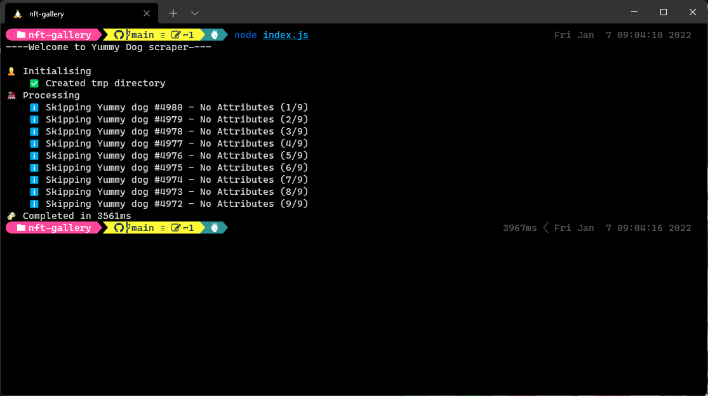

# Toolbox

Helper scripts package.

## NFT Gallery

Helper scripts to update `data.json` with newly minted nfts and owner information download and resize latest images.

- Metadata scraped from http://yummydog.yummy-crypto.com/meta/{id}
- Images scraped from http://yummydog.yummy-crypto.com/meta/image/{id}
- Owner information is grabbed directly from the contract. [View on BscScan](https://bscscan.com/token/0xd9dcf6d9b43cd7eca4c00ceffc965fcd4405c787)
- Scraping an item is skipped when the metadata contains no data. This happens when the NFT has been minted but the image has not been generated.

From the `toolbox/nft-gallery` directory

```
yarn install
node ./index.js
```


